# credit_risk_analysis
## Overview
The purpose of this analysis is to employ different techinques to train and evaluate models with unbalanced classes. These techniques will be used to evaluate the performance of the different models and help make a recommendation on whether the models should be used to help predict credit risk.

## Results

### 1. Naive Random Oversampling
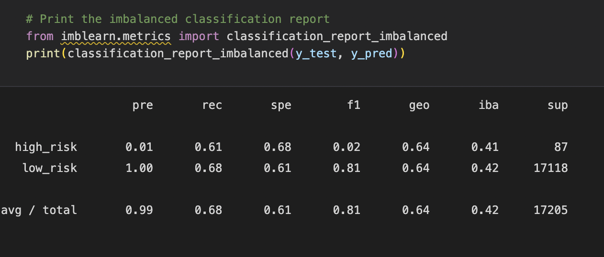
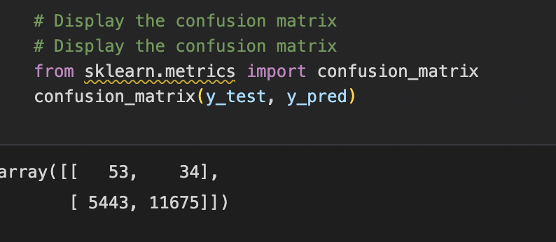
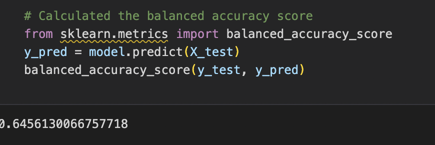
- The balanced accuracy of the naive random oversampling is 64.6%
- the high risk percentage is 1%
- Sensitivity is 61%
- F1 is 2%
- Precision is 99% with sensitivity of 68%

### 2. SMOTE Oversampling
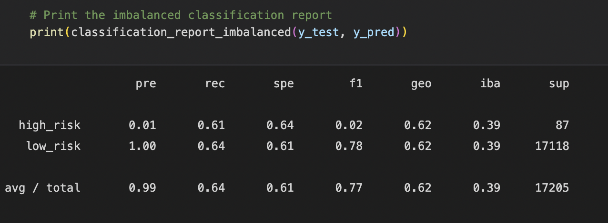
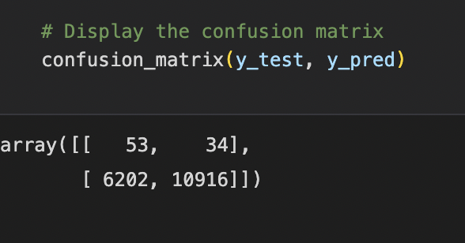
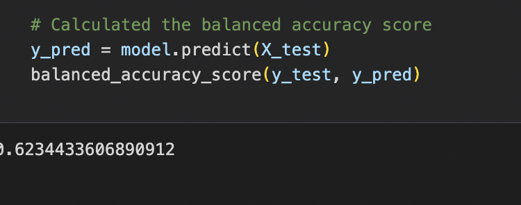
- The balanced accuracy of SMOTE Oversampling is 62.3%
- The high risk percentage is 1%
- Sensitivity is 61%
- F1 is 2%
- Precision is 99% with sensitivity of 64%

### 3. Undersampling
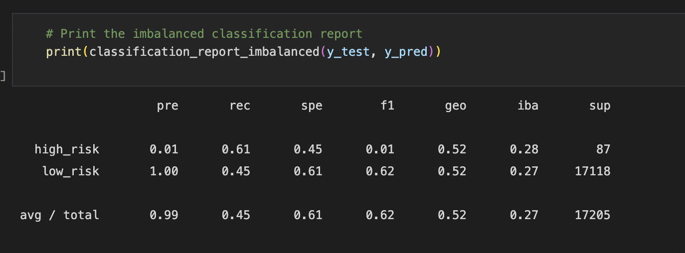
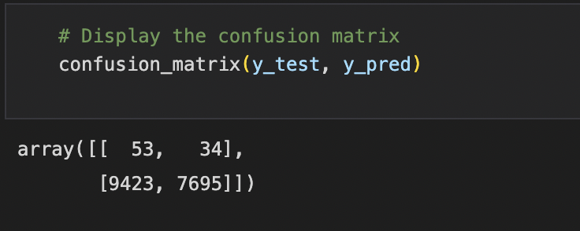
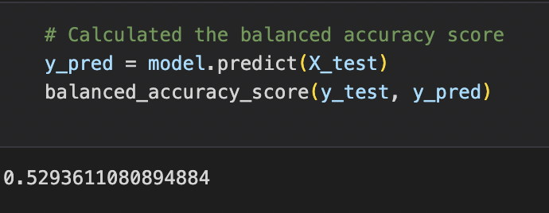
- The balanced accuracy of Undersampling Oversampling is 52.9%
- The high risk percentage is 1%
- Sensitivity is 61%
- F1 is 1%
- Precision is 99% with sensitivity of 45%

### 4. Combination Sampling
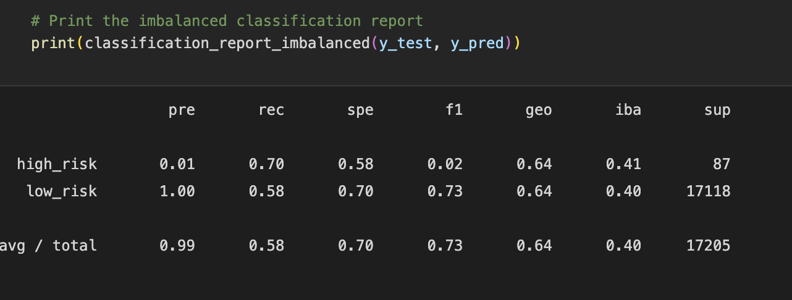
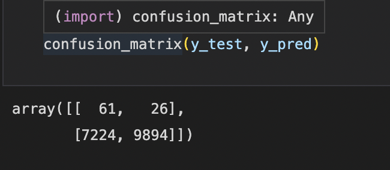
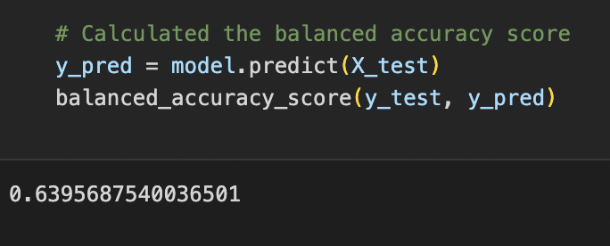
- The balanced accuracy of Combination Sampling Oversampling is 64%
- The high risk percentage is 1%
- Sensitivity is 70%
- F1 is 2%
- Precision is 99% with sensitivity of 58%

### 5. Balanced Random Forest Classifier
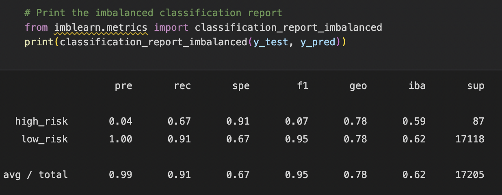
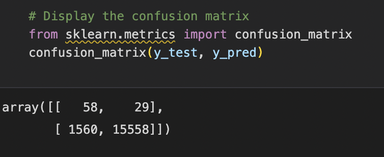

- The balanced accuracy of Balanced Random Forest Classifier Oversampling is 78.8%
- The high risk percentage is 4%
- Sensitivity is 67%
- F1 is 7%
- Precision is 99% with sensitivity of 91%

### 6. Easy Ensemble AdaBoost Classifier
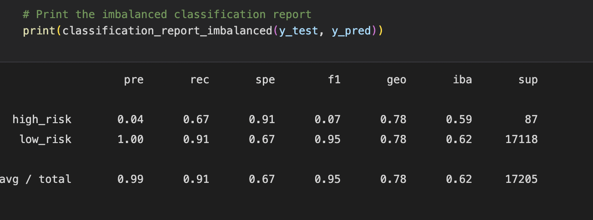
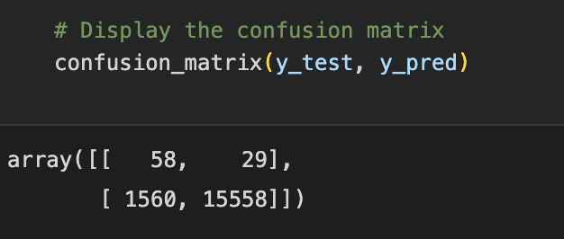
- The high risk percentage is 1%
- Sensitivity is 67%
- F1 is 7%
- Precision is 99% with sensitivity of 91%

## Sumary
Overall, most of the models show weak precision in determing credit risk. The low precision shows several credits being falsely detected as high risk, which would affect a bank's strategy and could affect revenue. It would not be recommended that the bank use these six models to help predict credit risk.
