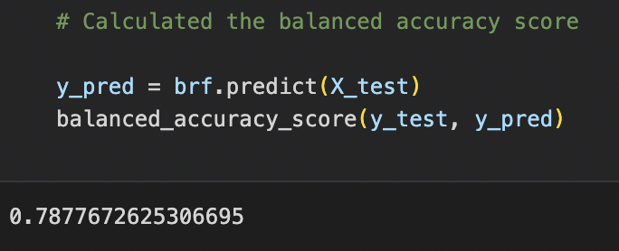

# credit_risk_analysis
## Overview

## Results

### 1. Naive Random Oversampling

### 2. SMOTE Oversampling

### 3. Undersampling

### 4. Combination Sampling

### 5. Balanced Random Forest Classifier

### 6. Easy Ensemble AdaBoost Classifier

## Sumary
